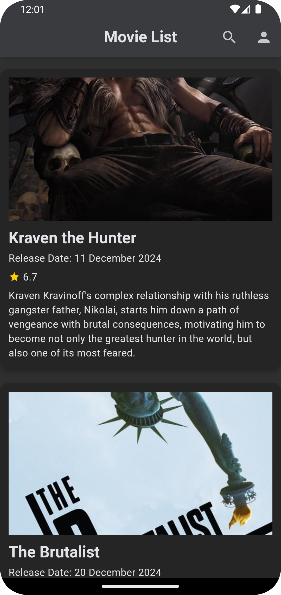
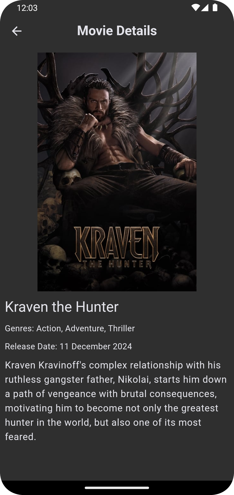
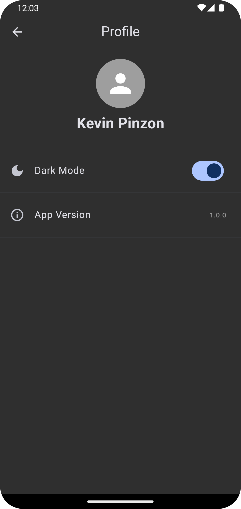

# 🎬 Movie App

A Flutter project for managing and viewing movies with a clean architecture, efficient data management, and several key features such as local database storage, movie pagination, and dark mode.

## 🚀 Features  

- **Movie Pagination:** Fetch and display movies in pages, with the ability to load more as the user scrolls.  
- **Search Movies by Name:** Search for movies by their title, enabling users to quickly find movies they want to watch.  
- **SQLite Local Database Storage:** Movie data is stored locally using SQFlite, ensuring offline access to previously fetched movies.  
- **Dependency Injection with GetIt:** Utilizes GetIt for managing and injecting dependencies across the application, providing a more modular and maintainable codebase.  
- **Dark Mode Support:** Switch between light and dark themes based on user preferences, enhancing user experience.  
- **Navigation with Go Router:** A routing system built using Go Router for cleaner and more maintainable app navigation.  
- **Firebase App Distribution:** Integrates Firebase for deployment and app distribution management, making the process smoother and more automated.  
- **Environment Variables:** Configuration is managed using environment variables to securely handle sensitive data such as API keys and app configurations.

## 📸 Screenshots

| Home Screen | Movie Detail | Profile Screen |
|-------------|--------------|----------------|
|  |  |  |

## 🛠️ Tech Stack  

- **Flutter (Dart)** for cross-platform mobile development  
- **Bloc** for state management  
- **GetIt** for dependency injection  
- **SQFlite** for local database storage  
- **Go Router** for navigation  
- **Firebase** for app distribution and analytics  
- **flutter_dotenv** for managing environment variables  

## 📖 Setup  

1. **Clone the repository:**  
```sh
git clone https://github.com/kevinPinzon/movie_app
cd movie_app
```

2. **Install dependencies:**  
```sh
flutter pub get
```

3. **Set up Firebase:**  
   - [Download the file `google-services.json` for Android](https://drive.google.com/drive/folders/1p6hk-JtYHvOccdrQkm2U_khtyoOA88MV?usp=sharing) and place it in `android/app/`.
   - [Download `GoogleService-Info.plist` file for iOS](https://drive.google.com/drive/folders/1p6hk-JtYHvOccdrQkm2U_khtyoOA88MV?usp=sharing) and place it in`ios/Runner/`.


4. **Configure Environment Variables:**  
To manage sensitive information such as API keys and app configurations, create a `.env` file in the root of the project with the necessary keys:

```env
AUTH_TOKEN=your_auth_token_here
```

   - [Download `.env` file](https://drive.google.com/drive/folders/1p6hk-JtYHvOccdrQkm2U_khtyoOA88MV?usp=sharing) and place it in the root.

5. **Run the app:**  
```sh
flutter run
```

## 🧪 Running Tests

To run tests in the project, use the following command:

```sh
flutter test
```

## 📝 Checklist

- [x] Set up Movie pagination  
- [x] Implement movie search by name  
- [x] Set up SQLite local storage with SQFlite  
- [x] Implement GetIt for dependency injection  
- [x] Add dark mode theme support  
- [x] Configure Go Router for navigation  
- [x] Set up Firebase for app distribution  
- [x] Implement profile screen
- [x] Implement error handling
- [x] Enhance UI with responsive design  

### Using Variables in Your Code:

You can use the `flutter_dotenv` package to load and access the environment variables defined in the `.env` file. Here's an example of how you would access  `AUTH_TOKEN` variables:

```dart
import 'package:flutter_dotenv/flutter_dotenv.dart';

class ApiService {
  String authToken = dotenv.env['AUTH_TOKEN'] ?? '';
  
  // Use apiKey and authToken as needed
}
```

Make sure to call `dotenv.load()` in the `main.dart` file before accessing the variables:

```dart
void main() async {
  WidgetsFlutterBinding.ensureInitialized();
  await dotenv.load(fileName: "assets/.env");
  runApp(App());
}
```

---

## 📌 Project Structure

The project follows a modular architecture with the following structure:

```
lib/
.
├── core
│   ├── common
│   │   ├── enums.dart
│   │   └── resource_images.dart
│   ├── database
│   │   └── movie_database.dart
│   ├── routes
│   │   └── navigation.dart
│   ├── services
│   │   ├── dependency_injection.dart
│   │   ├── firebase
│   │   │   └── firebase_service.dart
│   │   ├── movie
│   │   │   ├── movie_local_service.dart
│   │   │   └── movie_remote_service.dart
│   │   ├── network
│   │   │   ├── network_info.dart
│   │   │   ├── server_api_client.dart
│   │   │   └── server_info.dart
│   │   └── theme_storage_service.dart
│   ├── theme
│   │   ├── colors.dart
│   │   ├── fonts.dart
│   │   ├── sizes.dart
│   │   └── theme.dart
│   └── widgets
│       └── custom_app_bar.dart
├── feature
│   ├── init
│   │   └── presentation
│   │       └── screens
│   │           └── welcome_screen.dart
│   ├── movies
│   │   ├── data
│   │   │   ├── models
│   │   │   │   └── movie_model.dart
│   │   │   └── repositories
│   │   │       └── movie_repository_impl.dart
│   │   ├── domain
│   │   │   ├── entities
│   │   │   │   └── movie_entity.dart
│   │   │   ├── repositories
│   │   │   │   └── movie_repository.dart
│   │   │   └── use_cases
│   │   │       ├── fetch_movie_detail_use_case.dart
│   │   │       ├── fetch_movies_use_case.dart
│   │   │       ├── load_more_movies_use_case.dart
│   │   │       ├── movies_use_cases.dart
│   │   │       └── search_movies_use_case.dart
│   │   └── presentation
│   │       ├── blocs
│   │       │   ├── movie_bloc.dart
│   │       │   ├── movie_event.dart
│   │       │   └── movie_state.dart
│   │       ├── screens
│   │       │   ├── movie_detail_screen.dart
│   │       │   └── movie_list_screen.dart
│   │       └── widgets
│   │           ├── empty_state.dart
│   │           ├── movie_item.dart
│   │           └── movie_search_delegate.dart
│   ├── profile
│   │   └── presentation
│   │       └── screens
│   │           └── profile_screen.dart
│   └── theme
│       └── presentation
│           └── bloc
│               ├── theme_bloc.dart
│               ├── theme_event.dart
│               └── theme_state.dart
├── firebase_options.dart
└── main.dart
```

### Key files:

- **movie_database.dart**: Handles local storage for movie data using SQLite (SQFlite). Manages the movie data in a local database for offline access.
- **movie_bloc.dart**: Contains the business logic for handling movie fetching, searching, pagination, and error management through the use of the BLoC pattern.
- **app_router.dart**: Defines the routing logic with Go Router. Handles navigation between different screens, including movie list, movie details, and profile.
- **theme_bloc.dart**: Manages the app’s theme state (light/dark mode). Responsible for toggling between light and dark modes and persisting user preferences.
- **movie_repository.dart**: Provides methods to fetch movies either from a remote server or locally. Acts as the abstraction layer to communicate with data sources (local and remote).
- **movie_local_service.dart**: A service that interacts with the local database (SQFlite) to store and retrieve movies locally. Ensures offline functionality.
- **movie_remote_service.dart**: A service that interacts with a remote server (via an API client) to fetch movie data from an external source. Handles network requests and responses.
- **server_api_client.dart**: Handles the HTTP requests to communicate with the backend API. Manages GET, POST, and PATCH requests.
- **movie_model.dart**: Defines the structure of a movie object. This is used for serializing and deserializing movie data from and to JSON.
- **movie_entity.dart**: Defines the domain-level entity for a movie. It contains all the properties and methods that the app will use, such as id, title, overview, and voteAverage.
- **movie_repository_impl.dart**: Implements the MovieRepository interface by coordinating between movie_local_service and movie_remote_service. It decides where to fetch the movie data from (local or remote).
---

## 🚀 Download the app

Both the **iOS** and **Android** versions of the app have been uploaded to Firebase App Distribution. You can download and install the app by joining the distribution using the following links:

- **[Download Android App](https://appdistribution.firebase.dev/i/b0efcdff84e541a1)**
- **[Download iOS App](https://appdistribution.firebase.dev/i/249c82ee162104b0)**

Simply click on the respective link to join the app distribution and install the app directly on your device.

---